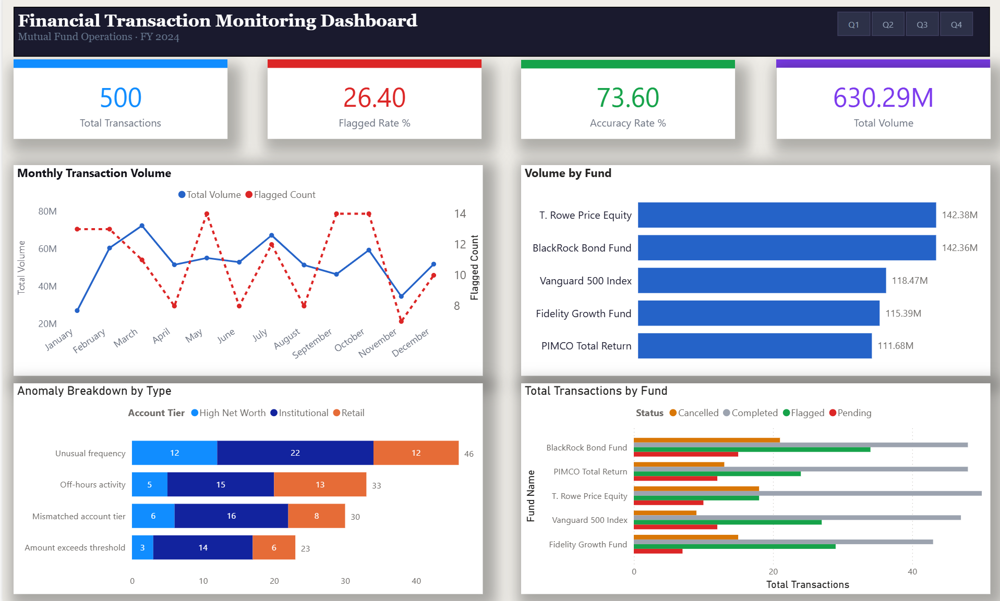
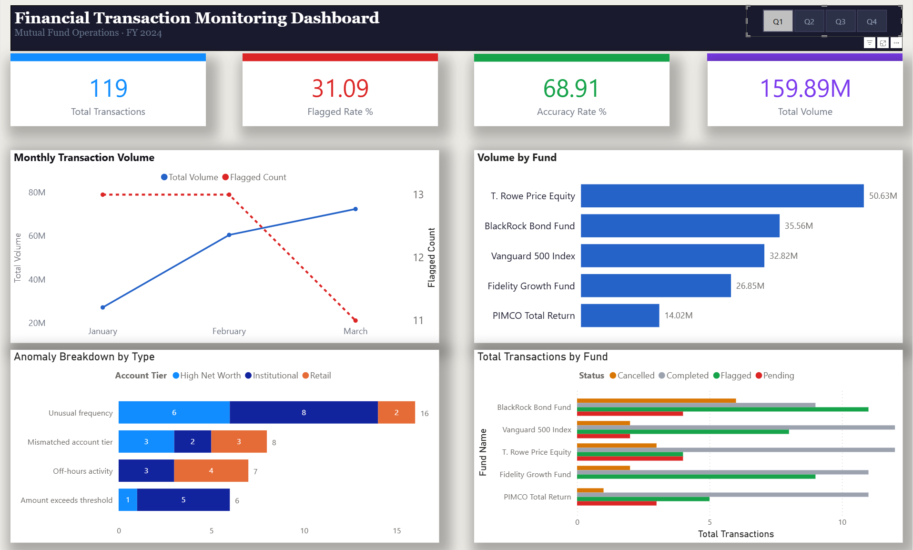

# Financial-transaction-dashboard
A Power BI dashboard I built to visualize and analyze mutual fund transaction data — modeled on the kind of monitoring and exception reporting I do in my day-to-day work as a Financial Analyst at BNY Mellon.



---

## What it does

The dashboard tracks 500 simulated mutual fund transactions across 5 funds throughout 2024. The goal was to surface the kind of insights that matter in financial operations — transaction volume trends, flagged anomalies, and data accuracy rates — in a way that's easy to read at a glance.

It has four main sections:
- **KPI cards** at the top for total transactions, flagged rate, accuracy rate, and total dollar volume
- **Monthly trend line** showing volume and flagged transaction count side by side across the year
- **Volume by fund** breaking down which funds are driving the most activity
- **Anomaly breakdown** showing what types of flags are occurring and which account tiers they're coming from

The Q1–Q4 slicer in the header filters everything on the page simultaneously.

---

## Tools used

| Tool | What I used it for |
|------|-------------------|
| Power BI Desktop | Dashboard design, data modeling, visuals |
| Power Query (M) | Data transformation, type casting, derived columns |
| DAX | KPI measures, CALCULATE(), time intelligence, MoM change |
| Excel | Companion summary workbook with PivotTables |
| Python | Generating the sample dataset |

---

## DAX measures written

- `Total Volume` — SUM of all transaction amounts
- `Flagged Count` — CALCULATE filtered to anomaly flag = Yes
- `Flagged Rate %` — DIVIDE of flagged count over total
- `Accuracy Rate %` — inverse of flagged rate
- `Avg Transaction` — AVERAGE transaction amount
- `Completed Volume` — CALCULATE filtered to completed status only
- `MoM Volume Change` — month-over-month % change using PREVIOUSMONTH time intelligence

---

## Screenshots

| Executive View | Q1 Filtered |
|---|---|
|  |  |

---

## Files in this repo

```
├── data/
│   └── financial_transactions.csv   # 500 sample transaction records
├── screenshots/
│   ├── dashboard-main.png
│   └── dashboard-q1-filtered.png
├── dashboard.pbix                   # Power BI file (open with free Power BI Desktop)
└── README.md
```

---

## Background

I work as a Financial Analyst at BNY Mellon processing and validating data for high-value mutual fund accounts daily. I built this to practice translating that work into a visual format and to get hands-on with Power BI, DAX, and dashboard design outside of work. The sample data was generated to reflect realistic transaction patterns, fund names, account tiers and anomaly types based on what I actually see in financial operations.

---

> **Note:** To view the dashboard interactively, download `dashboard.pbix` and open it with [Power BI Desktop](https://www.microsoft.com/en-us/power-platform/products/power-bi) (free).
